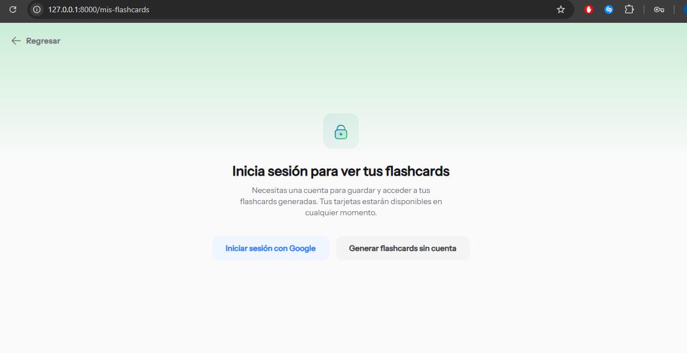
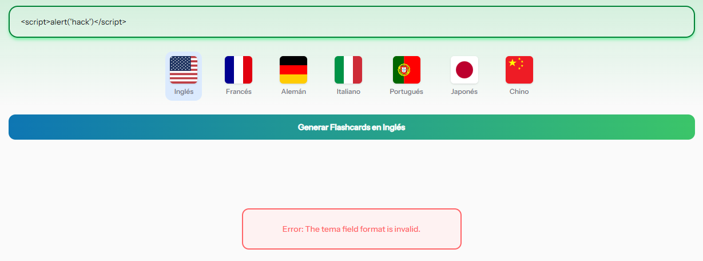
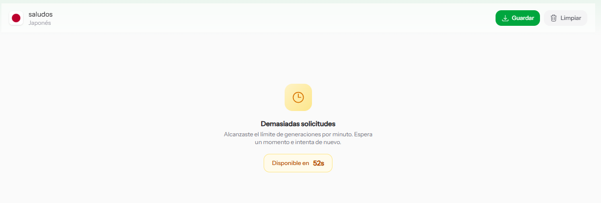

# 🛡️ Protección implementada OWASP TOP 10 — FlashLearn

Estándares de seguridad aplicados al proyecto. Se implementaron **3 controles** del estándar OWASP TOP 10, seleccionados según los riesgos más relevantes para la aplicación.

---

## A01:2025 — Control de acceso defectuoso
El control de acceso garantiza que los usuarios no puedan actuar fuera de sus permisos. Los fallos suelen provocar la divulgación no autorizada de información. 

## ¿Por qué aplica?
Esta app aplica a esta regla debido al autenticación con google, los usuarios no autenticados no deben tener el acceso a ver los flashcards de los usuarios autenticados

### ¿Qué se implmentó?
- El middleware auth protege /flashcards/my-sessions
- Un usuario no puede ver ni eliminar sesiones de otro

### Código aplicado
```php
//Rutas protegidas para guardar, consultar y eliminar sesiones de flashcards.
Route::middleware('auth')->group(function () {
    Route::post('/flashcards/save', [FlashcardSessionController::class, 'store'])->name('flashcards.save');
    Route::get('/flashcards/my-sessions', [FlashcardSessionController::class, 'index'])->name('flashcards.sessions');
    Route::get('/flashcards/my-sessions/{session}', [FlashcardSessionController::class, 'show'])->name('flashcards.session.show');
    Route::delete('/flashcards/my-sessions/{session}', [FlashcardSessionController::class, 'destroy'])->name('flashcards.session.destroy');
});
```
### Resultado

Si el usuario entra a la página `mis-flashcard` sin estar autenticado, no tendrá acceso y se le mostrará un mensaje de observación.



---

## A03:2025 — Injection
Injection cubre tanto SQL Injection como Prompt Injection. Esta app es vulnerable a Prompt Injection porque el input del usuario se inserta directamente en el prompt de la IA sin sanitización previa.

### ¿Por qué aplica?
El usuario escribe el tema de estudio libremente en un formulario. Sin validación, alguien podría intentar inyectar contenido malicioso que manipule el prompt enviado a la IA (*prompt injection*) o afecte la base de datos.

### ¿Qué se implementó?
- Validación estricta con `$request->validate()` en el controlador
- Longitud máxima del campo tema limitada a 100 caracteres
- El campo idioma solo acepta valores de una lista cerrada (`in:`)
- Sanitización del input antes de armar el prompt

### Código aplicado

```php
$validated = $request->validate([
    'tema' => [
        'required',
        'string',
        'min:3',
        'max:100',
        'regex:/^[\p{L}\p{N}\s\-_.,áéíóúÁÉÍÓÚñÑüÜ]+$/u'
    ],
    'language' => [
        'required',
        'string',
        Rule::in($this->availableLanguages)
    ],
]);

// Sanitizar antes de insertar en el prompt
$tema   = strip_tags(trim($validated['tema']));
$idioma = strip_tags(trim($validated['language']));
```

### Resultado



---

## A07:2025 — Fallos de identificación y autenticación (Rate Limiting)
Incluye la falta de controles contra ataques automatizados. El rate limiting protege el endpoint de generación contra abuso tanto de usuarios anónimos como autenticados.

### ¿Por qué aplica?
El endpoint `/generate` realiza una llamada a la IA en cada petición. Sin un límite de solicitudes, cualquier persona podría automatizar cientos de peticiones, abusando de la API key del proyecto y generando costos elevados.

### ¿Qué se implementó?
Rate limiting integrado de Laravel, limitando a **5 peticiones por minuto por IP (invitado)** y **10 peticiones por usuario autenticado** sobre el endpoint de generación.

### Código aplicado

**`App\Providers\AppServiceProvider.php`**
```php
use Illuminate\Cache\RateLimiting\Limit;
use Illuminate\Support\Facades\RateLimiter;
use Illuminate\Http\Request;

public function boot(): void
{
    RateLimiter::for('generate', function (Request $request) {
        return $request->user()
            ? Limit::perMinute(10)->by($request->user()->id)   // autenticado: 10/min
            : Limit::perMinute(5)->by($request->ip());          // invitado: 5/min
    });
}
```

**`routes/web.php`**
```php
Route::post('/generate', [FlashcardController::class, 'generate'])
     ->middleware('throttle:generate')
     ->name('flashcards.generate');
```

> Cuando se supera el límite, Laravel responde automáticamente con un error `429 Too Many Requests`.
> Y se renderiza en la vista.

### Resultado


---
